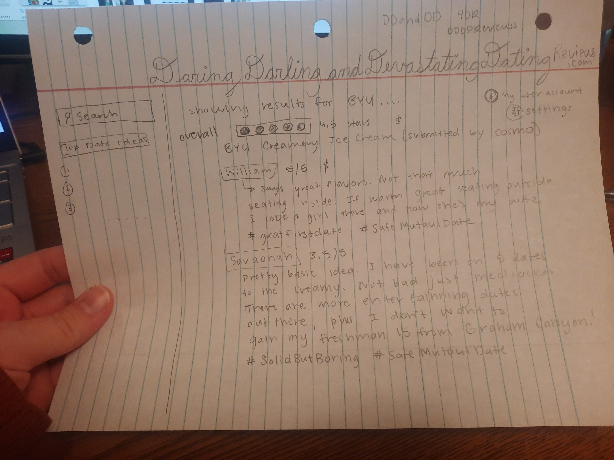
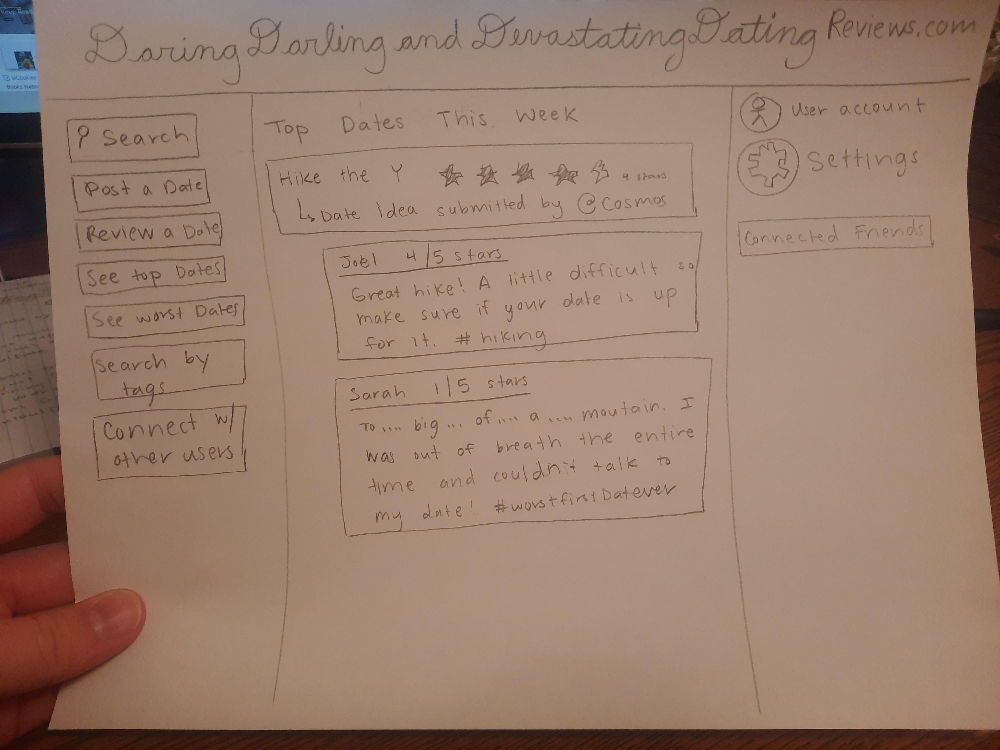

# startup
Startup assignment for CS 260 Web Development 

This is the repo I will be using for CS 260 and my start up application. I am excited to learn more about Web Development! 

I am modifying the README.md file from VS code! Yay! 
I am now modifying the README.md file from GitHub! Woohoo! 

I am changing this line... I am changing this line from VS code... and fixing the merge issue...

Notes about the GitHub assignment:

This is the classic github use patten to follow. 
1. Pull the repository's latest changes from GitHub (git pull)
2. Make changes to the code (Eliza's note: MAKE SURE TO SAVE IN VS CODE AFTER CHANGING THE CODE!)
3. Commit the changes (git commit)
4. Push the changes to GitHub (git push)

- Merging conflicts are annoying to fix but it is possible. The best thing to do is to be careful
and not create such conflicts 
- I created a personal access token. To create another one go to settings >> developer settings >> personal access token. Then follow the steps there. 

Elevator pitch for start-up 
Have you ever struggled to come up with a data idea? Maybe you googled data ideas and found lists out there that are pages and pages long! How do you know if one of those many ideas is even a good one? If you want to know if a restaurant is good there are many websites you can look up and see the reviews people who have eaten there have said. If you want to see if a professor is good, you can go to ratemyProfessor.com and see how many stars they have as well as the good and bad things about their classes. Why not do the same thing for data ideas?! DaringDarlingandDevastatingDatingReviews.com is here to the rescue. Whether you're single and want to impress your new love interest, in a serious relationship and ready to pop the question, or married and want to create a special anniversary or just spice up the normal night date this website is for you. Here people can submit data ideas and others can post reviews. Each dating idea will have a rating out of five stars and want others to have to say about it. This way you can be informed and plan the best dates to romance your significant other. 

Key features:
Each user must log in and create an account
A way to post new data ideas 
A rating system out of 5 stars for each data idea 
Also a cost for each data idea
A way for each user to comment/review data ideas 
A way for users to comment on others reviews
Possible to tag date ideas (greatFirstDate, SafeMutaulDate, ProposalWorthy, AmazingAnniversy, HerPlanningForHim, HimPlanningForHer, ClassicBYU, STEMMajorDate, ArtAdmirer, FriendZoner, Creepy, etc….) 
Monitor data idea and comments and delete inappropriate ones 
Search feature (by keyword or by tag) 
Top rated (5 stars, etc) page of date ideas 
Be able to save data ideas you like
Be about to follow other people and have them follow you. Allow others to see your save date ideas (So you can see what sounds fun to your significant other!) 

Rough sketches of my application



# AWS notes 
My server IP address is http://18.119.93.245/
In order to romote shell into my server, the command is ssh -i [key pair file] ubuntu@[ip address]
I now have a domain name that is associated with my IP address. It is darlingDateReviews.click. 
I have a record representing your root domain name and a wild card subdomain so I can access my website with 
my domain name and any subdomain name such as startup.darlingDateReviews.click

Caddy acts as a gateway to our different services and to host our static web application files. 
Caddy has ACME support built into it by default. We used Caddy to request a certificate from Let's Encrypt for you domain name.

# simon notes html
It is important to test your files before you deploy them to your production environment. 
As I was creating the simon html files, I noticed that they all had the same footer and the same header. Within the header each file contained the 
navigation elements allowing the user to go from page to page. 

# simon notes css
It is best to use a combination of bootstrap and css selectors and declarations. 
CSS makes our application visually appealing and adds intuitive user interface elements, but it is still not functional due to the lack of interactivity. 
How to refer to a CSS file for a HTML file using a link element. 
```html
<link rel="stylesheet" href="main.css" />
```
How to deply to my production environement. 
```sh
./deployFiles.sh -k <yourpemkey> -h <yourdomain> -s simon
```

# HTML Notes 
HyperText Markup Language (HTML) provides the foundational content structure that all web applications build on. 
HTML elements are represented with enclosing tags that may enclose other elements or text. Attributes describe the specific details of the element. 

# CSS Notes
Cascading Style Sheets (CSS) converts the structure and content of HTML into a vibrant, responsive, experience.
A rule is comprised of a selector that selects the elements to apply the rule to, and one or more declarations that represent the property to style with the given property value.
How to associate CSS with HTML
1. use the style attribute of an HTML element and explicitly assign one or more declarations.
2. use the HTML style element to define CSS rules within the HTML document
3. use the HTML link element to create a hyperlink reference to an external file containing CSS rules. Make appear in the head element of the document. 

CSS defines everything as boxes.


Different ways to add color to CSS: keyword, RGB hex, RGB function, HSL.

There are four major families of fonts: `Serif`, `san-serif`, `fixed`, and `symbol`. A serif is a small stroke attached to the ends of a character's major strokes. Serif fonts have the extra strokes, san-serif fonts do not.


## JavaScript Notes 
Officially known as ECMAScript. Typically JavaScript is executed using an interpreter at runtime instead of compiling it into a machine specific binary at build time. This has the advantage of making JavaScript very portable, but also allows for many errors, such as using an undefined variable. These types of errors commonly only get discovered when the program crashes during execution.
The JavaScript console object provides interaction with the JavaScript runtime's debugger console.
console.log('hello');
// OUTPUT: hello
console.time('demo time');
// ... some code that takes a long time.
console.timeEnd('demo time');
// OUTPUT: demo time: 9762.74 ms
console.count('a');
// OUTPUT: a: 1
console.count('a');
// OUTPUT: a: 2

How to add JavaScript to HTML:  You can insert JavaScript into HTML either by directly including it in the HTML within the content of a <script> element, or using by the src attribute of the script element to reference an external JavaScript file.
  
Variables are declared using either the `let` or `const` keyword. `let` allows you to change the value of the variable while `const` will cause an error if you attempt to change it. JavaScript is a weakly typed language. That means that a variable always has a type, but the variable can change type when it is assigned a new value, or that types can be automatically converted based upon the context that they are used in. Sometime the results of automatic conversions can be unexpected from programmers who are use to strongly typed languages.
  
JavaScript uses complex rules for defining equality that depend upon the conversion of a type to a boolean value. You will sometimes hear this referred to as falsy and truthy evaluations. To remove this confusion, JavaScript introduced the strict equality (===) and inequality (!==) operators. The strict operators skip the type conversion when computing equality. This results in the following.
  
# JSON 
JSON provides a simple, and yet effective way, to share and store data. By design JSON is easily convertible to, and from, JavaScript objects. This make it a very convenient data format when working with web technologies. Because of its simplicity, standardization, and compatibility with JavaScript, JSON has become one of the world's most popular data formats.
  
JSON document can contain these datatype: string, number, boolean, array, object, or null. Most commonly, a JSON document contains an object. Objects contain zero or more key value pairs. The key is always a string, and the value must be one of the valid JSON data types. Key value pairs are delimited with commas. Curly braces delimit an object, square braces and commas delimit arrays, and strings are always delimited with double quotes.
  
You can convert JSON to, and from, JavaScript using the `JSON.parse` and `JSON.stringify` functions.
```js
const obj = { a: 2, b: 'crockford', c: undefined };
const json = JSON.stringify(obj);
const objFromJson = JSON.parse(json);
```
  
# JavaScript regular expressions (textual pattern mathcers) 
You can create a regular expression using the class constructor or a regular expression literal.

```js
const objRegex = new RegExp('ab*', 'i');
const literalRegex = /ab*/i;
```
The `string` class has several functions that accept regular expressions. This includes `match`, `replace`, `search`, and `split`. For a quick test to see if there is a match you can use the regular expression object's `test` function.

```js
const petRegex = /(dog)|(cat)|(bird)/gim;
const text = 'Both cats and dogs are pets, but not rocks.';

text.match(petRegex);
// RETURNS: ['cat', 'dog']

text.replace(petRegex, 'animal');
// RETURNS: Both animals and animals are pets, but not rocks.

petRegex.test(text);
// RETURNS: true
```
  
# JavaScript Rest and Spread 
`rest` syntax allows you to make the last parameter of the function take as many things and combine them into an array. Provides variadic functions. 
```js
function hasNumber(test, ...numbers) {
  return numbers.some((i) => i === test);
}

hasNumber(2, 1, 2, 3);
// RETURNS: true
```
Spread does the opposite of rest. It take an object that is iterable (e.g. array or string) and expands it into a function's parameters. Consider the following example.
  
```js
function person(firstName, lastName) {
  return { first: firstName, last: lastName };
}

const p = person(...['Ryan', 'Dahl']);
console.log(p);
// OUTPUT: {first: 'Ryan', last: 'Dahl'}
```

# JavaScript Destructuring
 Destructuring is the process of pulling individual items out of an existing one, or removing structure. You can do this with either arrays or objects. This is helpful when you only care about a few items in the original structure.
  
Example one
```js
const a = [1, 2, 4, 5];

// destructure the first two items from a, into the new variables b and c
const [b, c] = a;

console.log(b, c);
// OUTPUT: 1, 2
  
const [b, c, ...others] = a;

console.log(b, c, others);
// OUTPUT: 1, 2, [4,5]
```
When object destructuring, you explicitly specify the properties you want to pull from the source object. You can map the names to new variables instead of just using the original property names.
  
```js
const o = { a: 1, b: 'animals', c: ['fish', 'cats'] };

const { a: count, b: type } = o;

console.log(count, type);
// OUTPUT 1, animals
```

# JavaScript Exceptions
  An exception can be triggered whenever your code generates an exception using the throw keyword, or whenever an exception is generated by the JavaScript runtime. A finally block that is always called whenever the try block is exited regardless if an exception was ever thrown. Restrict exceptions to truly exceptional situations, do not use as a way to handle normal flows of execution. Fallback pattern: you put the normal feature path in a try block and then provide a fallback implementation in the catch block. For example, normally you would get the high scores for a game by making a network request, but if the network is not available then a locally cached version of the last available scores is used. By providing a fallback, you can always return something, even if the desired feature is temporarily unavailable.
 
```js
try {
  // normal execution code
} catch (err) {
  // exception handling code
} finally {
  // always called code
}
```
